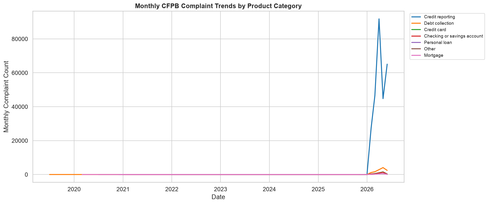
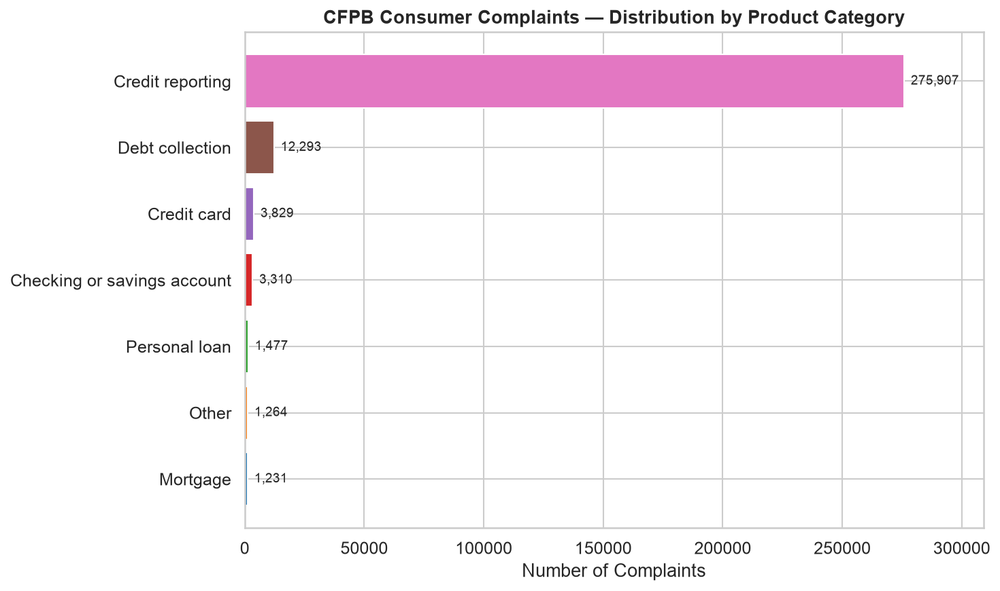
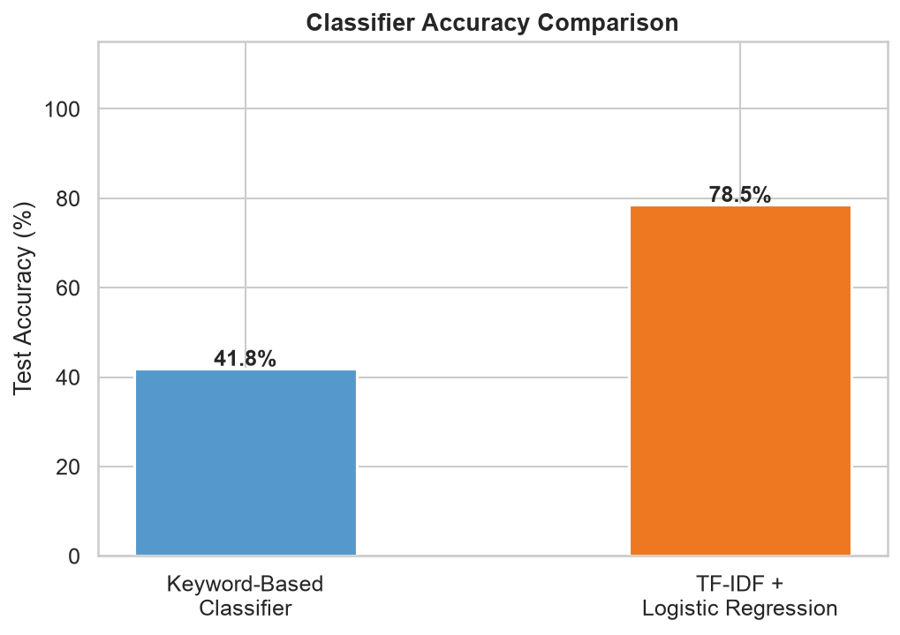

# CFPB Consumer Complaint Classifier

A text classification pipeline applied to the [CFPB Consumer Financial Protection Bureau Complaint Database](https://www.consumerfinance.gov/data-research/consumer-complaints/) — 15M+ real US financial complaints, updated daily.

Classifies complaint product categories by comparing a **keyword-based rule system** against a **TF-IDF + Logistic Regression** ML model.

---

## Results

| Classifier | Test Accuracy | Notes |
|---|---|---|
| Keyword-based (zero-shot) | **41.8 %** | No training, pure rule matching |
| TF-IDF + Logistic Regression | **78.5 %** | Unigram + bigram features, L2 regularisation |

300,000 complaints loaded · 4,252 with consumer narrative · 7 product categories







---

## Pipeline

```
Raw CFPB CSV (300 K rows streamed from bulk ZIP)
       │
       ▼
1. EDA — trends over time & distribution by category (full 300 K)
       │
       ▼
2. Filter to records with consumer narrative (~4 K records)
       │
       ▼
3. Text Preprocessing
   • Lowercase, strip URLs and CFPB redaction tokens (XXXX…)
   • NLTK word tokenisation
   • Remove English stopwords
   • WordNet lemmatisation
       │
       ▼
4. Classification  (80/20 train/test split, stratified)
   ├── Keyword Classifier   — score against per-category keyword lists
   └── TF-IDF + LR          — 15 K unigram+bigram TF-IDF → logistic regression
       │
       ▼
5. Evaluation — classification report, confusion matrices, accuracy comparison
```

---

## Data & Columns Used

| Column | Role |
|---|---|
| `Consumer complaint narrative` | Main NLP feature (free text, ~400 words avg) |
| `Product` | Classification target (7 simplified categories) |
| `Date received` | Time-series trend analysis |
| `Issue` / `Sub-issue` | EDA context |

Only ~1.5 % of complaints include a consumer narrative (requires explicit consumer consent to publish). The remaining records are used for EDA visualisations.

---

## Product Categories

| Category | Example keywords |
|---|---|
| Credit reporting | experian, equifax, transunion, dispute, inquiry |
| Debt collection | collector, validate, garnish, cease & desist |
| Mortgage | foreclosure, escrow, modification, servicer |
| Credit card | chargeback, rewards, billing, minimum payment |
| Checking / savings account | overdraft, direct deposit, ACH |
| Student loan | forgiveness, servicer, income-driven, deferment |
| Personal loan | payday, installment, APR, vehicle |

---

## Key Findings

- **Keyword matching** (~42 % accuracy) struggles with indirect language ("the company refused to fix my file" vs "credit report error") and overlapping vocabulary across categories.
- **TF-IDF + LR** (~79 % accuracy) learns corpus-specific bigrams like `"credit bureau"`, `"debt validation"`, `"escrow account"` that are uniquely predictive per class.
- Biggest confusion: *Debt collection* ↔ *Credit reporting* — both involve disputes over account history.
- Top features per class align with domain intuition (e.g. `"chime"`, `"zelle"` for Checking; `"mohela"`, `"sallie mae"` for Student loan).

---

## Setup

```bash
git clone https://github.com/priyashhagulati/NLP_Amex.git
cd NLP_Amex
pip install -r requirements.txt
```

---

## Usage

### Quick start (streams ~32 MB, reads 300 K rows, classifies 4 K narrated)
```bash
python main.py
```

### Cap rows for faster iteration
```bash
python main.py --sample 50000
```

### Use your own CSV (e.g. from [Kaggle](https://www.kaggle.com/datasets/cfpb/us-consumer-finance-complaints))
```bash
python main.py --data-path data/complaints.csv
```

### Jupyter notebook walkthrough
```bash
jupyter notebook notebooks/analysis.ipynb
```

All figures are saved to `outputs/figures/`.

---

## Project Structure

```
├── src/
│   ├── download_data.py   # CFPB bulk ZIP streaming (extracts only N rows)
│   ├── preprocess.py      # Clean → tokenise → stopwords → lemmatise
│   ├── classify.py        # KeywordClassifier + TfidfLRClassifier
│   └── visualize.py       # Matplotlib / Seaborn plots
├── notebooks/
│   └── analysis.ipynb     # End-to-end Jupyter walkthrough
├── outputs/figures/       # Generated plots (committed)
├── data/                  # Data files (gitignored, re-downloaded on first run)
├── main.py                # CLI entry point
└── requirements.txt
```

---

## Dependencies

| Package | Purpose |
|---|---|
| scikit-learn | TF-IDF, Logistic Regression, evaluation metrics |
| nltk | Tokenisation, stopwords, WordNet lemmatisation |
| pandas / numpy | Data wrangling |
| matplotlib / seaborn | Visualisation |
| requests / tqdm | Streaming bulk ZIP download |
